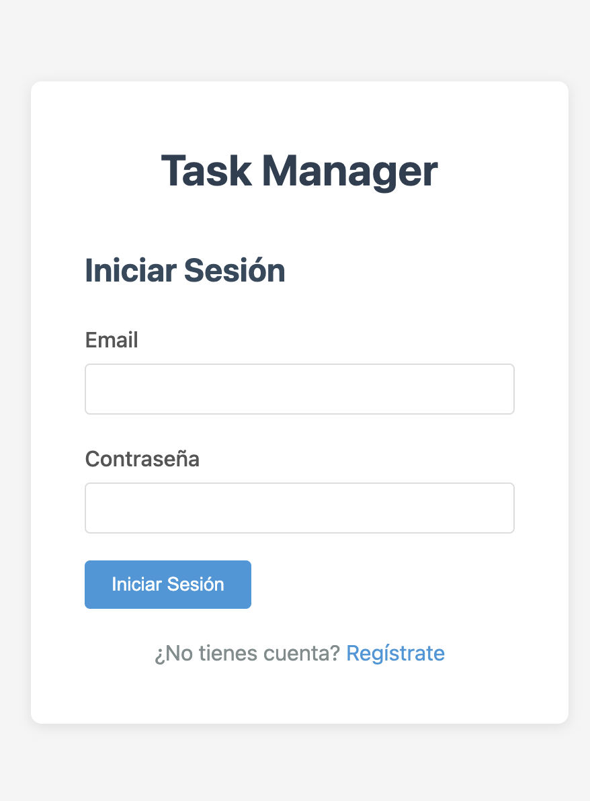
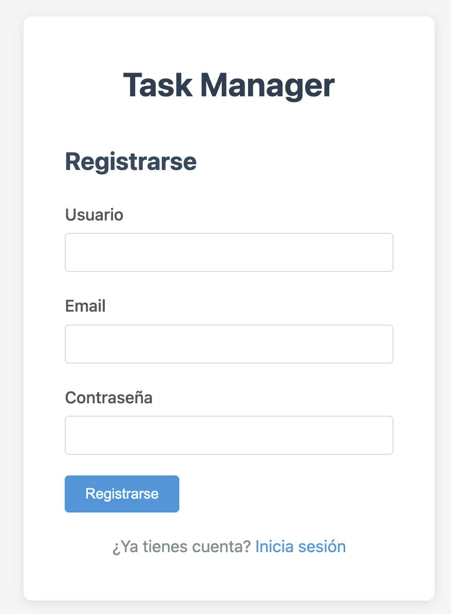
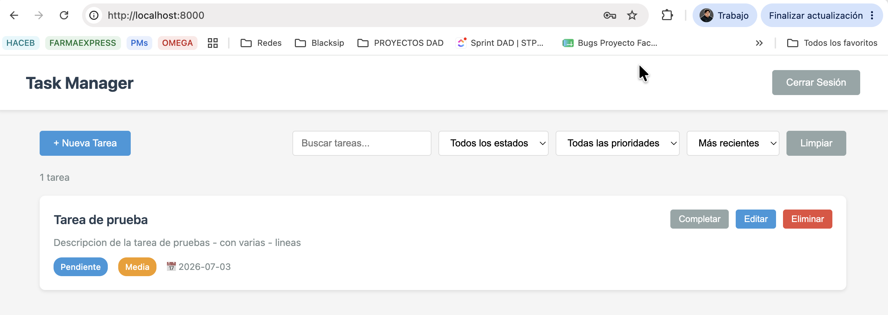
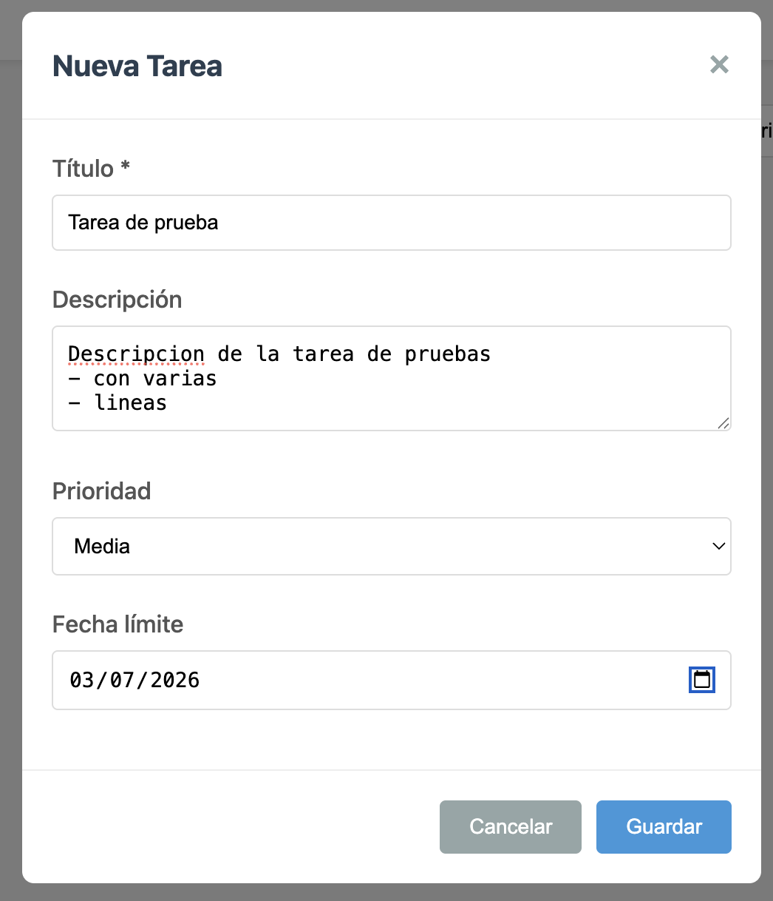
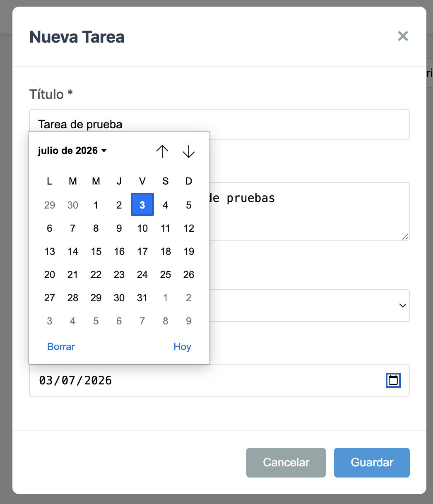

# Task Manager - Gestor de Tareas

Aplicación web completa para gestión de tareas con autenticación de usuarios, persistencia en base de datos local y despliegue con Docker.

## Características

- **Autenticación de usuarios**: Registro e inicio de sesión con JWT
- **Gestión completa de tareas**: Crear, leer, actualizar y eliminar tareas
- **Propiedades de tareas**: Título, descripción, prioridad (alta/media/baja), estado (pendiente/completada), fecha límite
- **Filtros y búsqueda**: Filtrar por estado y prioridad, buscar por texto, ordenar por múltiples criterios
- **Persistencia de datos**: Base de datos SQLite local
- **Seguridad**: Contraseñas hasheadas con bcrypt, tokens JWT con expiración
- **Diseño responsivo**: Interfaz adaptable a dispositivos móviles y desktop
- **Docker**: Despliegue containerizado con volúmenes persistentes

## Requisitos Previos

### Despliegue con Docker
- Docker 20.10 o superior
- Docker Compose 2.0 o superior

## Instalación y Ejecución

### Paso 1: Clonar o descargar el repositorio
```bash
cd ia2_actividad_1
```

### Paso 2: Levantar la aplicación con Docker

**Opción A: Producción (recomendado)**
```bash
make docker-up
```

**Opción B: Desarrollo con hot-reload**
```bash
make docker-dev
```

### Paso 3: Acceder a la aplicación

Abrir en el navegador: http://localhost:8000

### Paso 4: Detener la aplicación
```bash
make docker-down
```

### Paso 5: Detener y eliminar volúmenes (⚠️ elimina los datos)
```bash
docker-compose down -v
```

## Makefile - Comandos Rápidos

El proyecto incluye un `Makefile` para facilitar las tareas comunes de desarrollo:

```bash
make help              # Mostrar todos los comandos disponibles
```

### Comandos Principales

```bash
# Docker
make docker-build      # Construir imagen Docker
make docker-up         # Levantar aplicación con Docker Compose
make docker-down       # Detener aplicación Docker
make docker-logs       # Ver logs de Docker en tiempo real
make docker-restart    # Reiniciar contenedores Docker
make docker-dev        # Levantar en modo desarrollo con Docker (hot-reload)

# Mantenimiento
make clean             # Limpiar archivos temporales y cache
make db-reset          # Resetear base de datos (elimina todos los datos)
```

### Flujo de Trabajo Típico

**Primer uso:**
```bash
make docker-up         # Levantar aplicación
```

**Desarrollo diario:**
```bash
make docker-dev        # Desarrollo con hot-reload
```

**Ver logs:**
```bash
make docker-logs       # Ver logs en tiempo real (Ctrl+C para salir)
```

**Reiniciar todo:**
```bash
make clean               # Detener Docker, eliminar volúmenes y limpiar cache
make docker-up           # Levantar nuevamente
```

## Uso

### Registro de Usuario

1. Acceder a http://localhost:8000
2. Hacer clic en "Regístrate"
3. Completar el formulario con usuario, email y contraseña (mínimo 6 caracteres)
4. Hacer clic en "Registrarse"

### Inicio de Sesión

1. Ingresar email y contraseña
2. Hacer clic en "Iniciar Sesión"

### Gestión de Tareas

#### Crear una tarea
1. Hacer clic en "+ Nueva Tarea"
2. Completar el formulario:
   - **Título** (obligatorio)
   - **Descripción** (opcional)
   - **Prioridad**: Alta, Media, Baja
   - **Fecha límite** (opcional)
3. Hacer clic en "Guardar"

#### Editar una tarea
1. Hacer clic en "Editar" en la tarea deseada
2. Modificar los campos necesarios
3. Hacer clic en "Guardar"

#### Cambiar estado de tarea
- Hacer clic en "Completar" o "Reabrir" para cambiar el estado

#### Eliminar una tarea
1. Hacer clic en "Eliminar"
2. Confirmar la eliminación en el diálogo

### Filtros y Búsqueda

- **Buscar**: Escribir en el campo de búsqueda (busca en título y descripción)
- **Filtrar por estado**: Seleccionar "Pendientes", "Completadas" o "Todos"
- **Filtrar por prioridad**: Seleccionar "Alta", "Media", "Baja" o "Todas"
- **Ordenar**: Seleccionar criterio (Más recientes, Más antiguas, Fecha límite, Prioridad, Título)
- **Limpiar filtros**: Hacer clic en "Limpiar" para resetear todos los filtros

### Cerrar Sesión

Hacer clic en "Cerrar Sesión" en la esquina superior derecha

## API Documentation

La API incluye documentación interactiva automática:

- **Swagger UI**: http://localhost:8000/docs
- **ReDoc**: http://localhost:8000/redoc
- **OpenAPI JSON**: http://localhost:8000/openapi.json

### Endpoints de Autenticación

#### POST /api/auth/register
Registro de nuevo usuario

**Request:**
```json
{
  "username": "john",
  "email": "john@example.com",
  "password": "secret123"
}
```

**Response (201 Created):**
```json
{
  "access_token": "eyJhbGciOiJIUzI1NiIsInR5cCI6IkpXVCJ9...",
  "token_type": "bearer"
}
```

**Errores:**
- 400: Username already registered / Email already registered

#### POST /api/auth/login
Inicio de sesión

**Request:**
```json
{
  "email": "john@example.com",
  "password": "secret123"
}
```

**Response (200 OK):**
```json
{
  "access_token": "eyJhbGciOiJIUzI1NiIsInR5cCI6IkpXVCJ9...",
  "token_type": "bearer"
}
```

**Errores:**
- 401: Invalid email or password

### Endpoints de Tareas

Todos los endpoints de tareas requieren autenticación JWT. Incluir el token en el header:
```
Authorization: Bearer <access_token>
```

#### POST /api/tasks/
Crear nueva tarea

**Request:**
```json
{
  "title": "Completar proyecto",
  "description": "Finalizar la aplicación web",
  "priority": "high",
  "due_date": "2026-07-01"
}
```

**Response (201 Created):**
```json
{
  "id": 1,
  "title": "Completar proyecto",
  "description": "Finalizar la aplicación web",
  "status": "pending",
  "priority": "high",
  "due_date": "2026-07-01",
  "created_at": "2026-06-27T10:30:00",
  "updated_at": null,
  "user_id": 1
}
```

**Errores:**
- 400: Title is required / Priority must be low, medium, or high
- 401: Not authenticated

#### GET /api/tasks/
Listar todas las tareas del usuario autenticado

**Response (200 OK):**
```json
[
  {
    "id": 1,
    "title": "Completar proyecto",
    "description": "Finalizar la aplicación web",
    "status": "pending",
    "priority": "high",
    "due_date": "2026-07-01",
    "created_at": "2026-06-27T10:30:00",
    "updated_at": null,
    "user_id": 1
  }
]
```

#### GET /api/tasks/{task_id}
Obtener tarea específica

**Response (200 OK):**
```json
{
  "id": 1,
  "title": "Completar proyecto",
  "description": "Finalizar la aplicación web",
  "status": "pending",
  "priority": "high",
  "due_date": "2026-07-01",
  "created_at": "2026-06-27T10:30:00",
  "updated_at": null,
  "user_id": 1
}
```

**Errores:**
- 404: Task not found

#### PUT /api/tasks/{task_id}
Actualizar tarea

**Request:**
```json
{
  "title": "Proyecto completado",
  "status": "completed",
  "priority": "high"
}
```

**Response (200 OK):**
```json
{
  "id": 1,
  "title": "Proyecto completado",
  "description": "Finalizar la aplicación web",
  "status": "completed",
  "priority": "high",
  "due_date": "2026-07-01",
  "created_at": "2026-06-27T10:30:00",
  "updated_at": "2026-06-27T11:00:00",
  "user_id": 1
}
```

**Errores:**
- 400: Title cannot be empty / Status must be pending or completed
- 404: Task not found

#### DELETE /api/tasks/{task_id}
Eliminar tarea

**Response (200 OK):**
```json
{
  "message": "Task deleted successfully"
}
```

**Errores:**
- 404: Task not found

## Capturas de Pantalla

### Pantalla de Login


### Pantalla de Registro


### Lista de Tareas y Filtros


### Crear Nueva Tarea


### Selector de Fecha


## Troubleshooting

### Error: "Port 8000 already in use"
**Solución**: Detener otra aplicación que use el puerto 8000 o cambiar el puerto:
```bash
uvicorn main:app --port 8001
```

### Error: "ModuleNotFoundError: No module named 'fastapi'"
**Solución**: Activar el entorno virtual e instalar dependencias:
```bash
source venv/bin/activate
pip install -r requirements.txt
```

### Error: "Database locked"
**Solución**: SQLite no soporta múltiples escrituras simultáneas. Cerrar otras instancias de la aplicación.

### Error de Docker: "Cannot connect to the Docker daemon"
**Solución**: Iniciar Docker Desktop o el servicio Docker:
```bash
sudo systemctl start docker  # Linux
# o iniciar Docker Desktop en macOS/Windows
```

### Error de Docker: "Port 8000 is already in use"
**Solución**: Cambiar el puerto en docker-compose.yml:
```yaml
ports:
  - "8001:8000"
```

### Los datos se pierden al reiniciar Docker
**Solución**: Verificar que el volumen esté configurado correctamente en docker-compose.yml:
```yaml
volumes:
  - db_data:/app/database
```

### Error de autenticación: "Token has expired"
**Solución**: El token JWT expira después de 30 minutos. Iniciar sesión nuevamente para obtener un nuevo token.

### Error: "Invalid token"
**Solución**: El token puede estar corrupto o ser inválido. Cerrar sesión e iniciar nuevamente.

## Estructura del Proyecto

```
ia2_actividad_1/
├── backend/
│   ├── __init__.py
│   ├── auth.py              # Autenticación JWT y hashing
│   ├── database.py          # Configuración de base de datos
│   ├── models.py            # Modelos SQLAlchemy
│   ├── schemas.py           # Esquemas Pydantic
│   └── routers/
│       ├── auth.py          # Endpoints de autenticación
│       └── tasks.py         # Endpoints de tareas
├── frontend/
│   ├── index.html           # Interfaz web
│   ├── styles.css           # Estilos CSS
│   ├── auth.js              # Lógica de autenticación
│   ├── api.js               # Llamadas a API
│   └── app.js               # Lógica de la aplicación
├── database/                # Base de datos SQLite (generado)
├── main.py                  # Punto de entrada FastAPI
├── Makefile                 # Comandos rápidos de desarrollo
├── requirements.txt         # Dependencias Python
├── Dockerfile               # Configuración Docker
├── docker-compose.yml       # Orquestación Docker
├── docker-compose.dev.yml   # Configuración desarrollo
├── .env                     # Variables de entorno
└── README.md                # Este archivo
```

## Tecnologías Utilizadas

### Backend
- **FastAPI**: Framework web moderno y rápido
- **SQLAlchemy**: ORM para base de datos
- **SQLite**: Base de datos local
- **Pydantic**: Validación de datos
- **python-jose**: Manejo de tokens JWT
- **passlib**: Hashing de contraseñas con bcrypt

### Frontend
- **HTML5**: Estructura semántica
- **CSS3**: Estilos responsivos
- **JavaScript (ES6+)**: Lógica de la aplicación
- **Fetch API**: Llamadas HTTP

### Despliegue
- **Docker**: Containerización
- **Docker Compose**: Orquestación de contenedores

## Limitaciones Conocidas

1. **SQLite**: No diseñado para alto tráfico concurrente
2. **JWT en localStorage**: Vulnerable a ataques XSS (aceptable para proyecto académico)
3. **Sin roles de usuario**: Todos los usuarios tienen los mismos permisos
4. **Sin recuperación de contraseña**: No implementado en esta versión
5. **Un solo usuario por tarea**: No hay tareas compartidas

## Trabajo Futuro

- Implementar recuperación de contraseña
- Añadir roles de usuario (admin/user)
- Soporte para tareas compartidas
- Exportación de tareas a CSV/PDF
- Notificaciones por email
- API REST completa con paginación
- Tests automatizados
- Despliegue en producción con base de datos PostgreSQL

## Licencia

Proyecto académico desarrollado para la asignatura de Desarrollo de Aplicaciones con Asistentes de Programación basados en IA.

## Contacto

Para dudas o comentarios sobre el proyecto, contactar al equipo de desarrollo.
